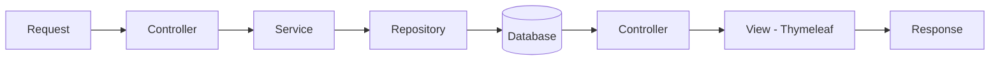

# Spring Library App

Aplicação Web simples para gerenciamento de biblioteca, construída com **Spring Boot**, com foco em conceitos fundamentais de desenvolvimento Backend Java.

## Objetivo

Este projeto tem como finalidade demonstrar, de forma didática, os principais conceitos de:

* Arquitetura em camadas
* Persistência com JPA/Hibernate
* Relacionamentos entre entidades
* Spring MVC
* Integração com Thymeleaf

## Tecnologias Utilizadas

* Java 25 LTS
* Spring Boot 4.1.0 (SNAPSHOT)
* Spring Framework 7
* Maven 3.9.x
* Spring Data JPA
* Spring Web MVC
* Thymeleaf
* H2 Database

## Arquitetura

A aplicação segue o padrão em camadas:

```
Controller → Service → Repository → Database
```

### Camadas

* **Controller:** Recebe requisições HTTP
* **Service:** Contém regras de negócio
* **Repository:** Acesso ao banco de dados
* **Entity (Model):** Representação das tabelas

## Modelagem de Dados

### Author

* `id: Long`
* `firstName: String`
* `lastName: String`
* Relacionamento Many-to-Many com Book

### Book

* `id: Long`
* `title: String`
* `isbn: String`
* Many-to-Many com Author
* Many-to-One com Publisher

### Publisher

* `id: Long`
* `publisherName: String`
* `address: String`
* `city: String`
* `state: String`
* `zipCode: String`
* One-to-Many com Book

### Tabela Intermediária

Criada automaticamente:

`author_book`

* `book_id`
* `author_id`

## Relacionamentos JPA

### Many-to-Many

* Um Author pode ter vários Books
* Um Book pode ter vários Authors

### One-to-Many

* Um Publisher pode ter vários Books

### Many-to-One

* Um Book pertence a um Publisher

## Service Layer

Separação clara de responsabilidades:

* Define contratos via interfaces
* Implementa regras de negócio

## Spring Data JPA

* Interfaces que estendem `JpaRepository`
* CRUD automático
* Sem necessidade de SQL manual

## Spring MVC

Fluxo da aplicação:



## Thymeleaf

Responsável por gerar HTML dinâmico no lado do servidor.

## Inicialização de Dados

* Implementado com `CommandLineRunner`
* Popula o banco automaticamente ao iniciar a aplicação
* Demonstra os relacionamentos entre entidades

## Configuração (application.yml)

* Banco H2 em memória
* Console habilitado
* Hibernate com geração automática de schema

## Acessos

| Recurso    | URL                                                                  |
|------------|----------------------------------------------------------------------|
| Books      | [http://localhost:8080/books](http://localhost:8080/books)           |
| Authors    | [http://localhost:8080/authors](http://localhost:8080/authors)       |
| Publishers | [http://localhost:8080/publishers](http://localhost:8080/publishers) |
| H2 Console | [http://localhost:8080/h2-console](http://localhost:8080/h2-console) |

## Fluxo da Aplicação

### Externo

1. Navegador envia requisição HTTP
2. Servidor (Tomcat embutido) recebe
3. Spring Boot processa
4. HTML é retornado

### Interno

1. Controller recebe a requisição
2. Service aplica lógica de negócio
3. Repository acessa o banco
4. Hibernate gera SQL automaticamente
5. Thymeleaf renderiza HTML

## Boas Práticas Aplicadas

* Uso de `Set<>` em relacionamentos
* Injeção de dependência via construtor
* Separação de responsabilidades
* Código limpo e didático
* Sem uso de Lombok
* Sem uso de DTOs

## Observações

* Projeto voltado para iniciantes
* Foco em entendimento, não em complexidade
* Estrutura preparada para evolução (CRUD completo, API REST, validações)

## Como Executar

```bash
mvn spring-boot:run
```

## Resultado

Aplicação Web funcional com:

* Persistência com JPA/Hibernate
* Banco em memória H2
* Arquitetura MVC
* Renderização com Thymeleaf

## Conclusão

Este projeto serve como base sólida para quem está iniciando com Spring Boot, permitindo evoluir facilmente para aplicações mais robustas.


